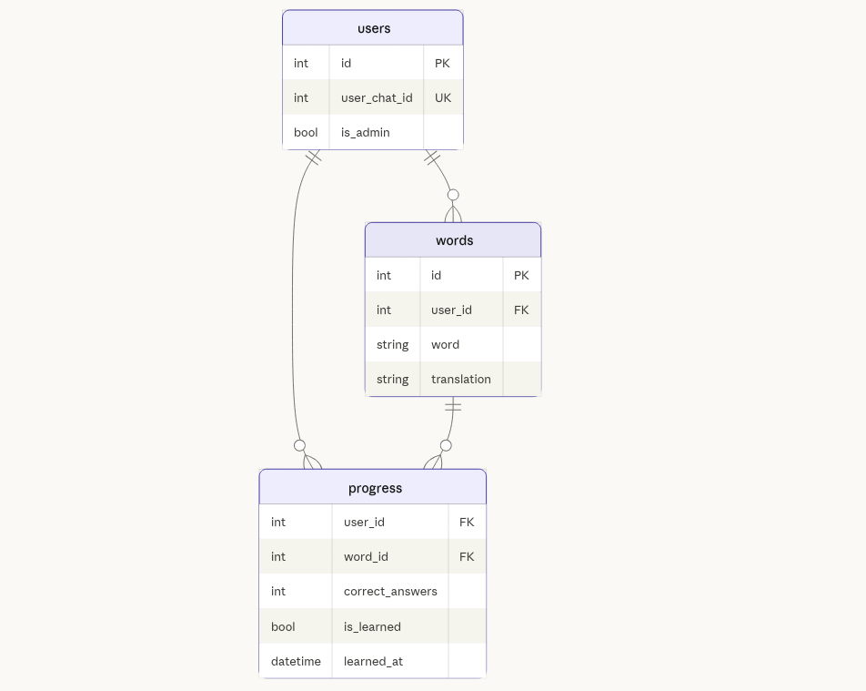

# English Words Learning Telegram Bot 🇬🇧

Telegram-бот для изучения английских слов через интерактивную викторину.

## Возможности

### 🎯 Основной режим
- **Викторина**: бот показывает слово на русском, нужно выбрать правильный английский перевод
- **Прогресс**: каждое слово требует 5 правильных ответов для изучения
- **Умный подбор**: изученные слова исключаются из викторины

### 📝 Управление словами
- **Добавление**: добавляйте свои пары слов (английский → русский)
- **Удаление**: удаляйте слова из вашего списка
- **База слов**: команда `/add_data` загружает пользовательские слова из `user_words.json`
- **Общие слова**: команда `/add_common_data` загружает базовые слова из `base_words.json` (только для администраторов)

### 📊 Система прогресса
- Отслеживание правильных ответов (0–5) за каждое слово
- Автоматическая отметка слова как «изученного» после 5 верных ответов
- Фиксация времени изучения

### 🎮 Интерфейс
- Кнопки для быстрого выбора ответа
- Кнопка «➡️ Дальше» для пропуска слова
- Поддержка повторных попыток при ошибке

---

## Технологии

| Компонент | Технология |
|-----------|------------|
| Бот-фреймворк | python-telegram-bot |
| ORM | SQLAlchemy (async) + asyncpg |
| База данных | PostgreSQL 15 |
| Настройки | pydantic-settings |
| Контейнеризация | Docker Compose |


---

## Развёртывание

### Требования

- Python 3.10+
- Docker и Docker Compose
- Виртуальное окружение (`.venv`)

### Шаг 1: Клонирование репозитория

```bash
cd DB_final
```

### Шаг 2: Создание файла окружения

Создайте файл `.env` с необходимыми переменными:

```env
# Токен бота (получить у @BotFather)
BOT_TOKEN=your_telegram_bot_token_here

# Настройки прокси (опционально, для регионов с ограниченным доступом)
PROXY_HOST=
PROXY_PORT=

# Настройки базы данных
DB_USER=your_db_user_name
DB_PASSWORD=your_secure_password
DB_NAME=your_db_namet
DB_HOST=localhost
DB_PORT=your_db_port
DB_ECHO=false
```

> ⚠️ **Важно**: Не коммитьте файл `.env` в репозиторий — он уже добавлен в `.gitignore`.


 - Если установлен docker можно разернуть postgres:

```bash
docker compose up -d postgres
```
Все необходимые данные подтягиваются из .env


### Шаг 3: Установка зависимостей

```bash
# Создание виртуального окружения
python -m venv .venv

# Активация виртуального окружения (Linux/macOS)
source .venv/bin/activate

# Активация виртуального окружения (Windows)
.venv\Scripts\activate

# Установка зависимостей
pip install -r requirements.txt
```

### Шаг 4: Запуск бота

```bash
python main.py
```
При первом запуске таблицы базы данных будут созданы автоматически.

---

## Использование

### Команды бота

| Команда | Описание |
|---------|----------|
| `/start` | Запуск бота, приветствие и начало викторины |
| `/cards` | Альтернативная команда запуска |
| `/add_data` | Загрузить слова из `user_words.json` |
| `/add_common_data` | Загрузить общие слова из `base_words.json` (только админ) |

> ⚠️ **Важно**: После первого запуска команды /start ваш пользователь будеть добавлен в БД
> зайдите используя DBeaver или PGAdmin и установите значение is_admin в True для загруки общих слов

### Кнопки интерфейса

| Кнопка | Действие |
|--------|----------|
| **➡️ Дальше** | Пропустить текущее слово |
| **📝 Добавить слово** | Добавить новое слово |
| **🚫 Удалить слово** | Удалить слово из вашего списка |

### Сценарий использования

1. Запустите бота командой `/start`
2. Загрузите слова командой `/add_data` или `/add_common_data`
3. Выбирайте правильный перевод из предложенных вариантов
4. Добавляйте свои слова через кнопку «📝 Добавить слово»
5. Следите за прогрессом: 5 правильных ответов = слово изучено ✅
6. Прогресс сбрасывается командой `/start` или `/cards`

---

### Схема базы данных



**users**
- `id` — уникальный идентификатор пользователя
- `user_chat_id` — Telegram chat ID (уникальный)
- `is_admin` — флаг администратора (по умолчанию false)

**words**
- `id` — уникальный идентификатор слова
- `user_id` — владелец слова (NULL = общее слово)
- `word` — слово на английском
- `translation` — перевод на русский

**progress**
- `user_id` — идентификатор пользователя (PK, FK)
- `word_id` — идентификатор слова (PK, FK)
- `correct_answers` — количество верных ответов (0–5)
- `is_learned` — флаг изученного слова
- `learned_at` — timestamp изучения

---

## Архитектура

```
┌─────────────┐     ┌──────────────┐     ┌─────────────┐
│  Telegram   │────▶│   Bot App    │────▶│  PostgreSQL │
│   Client    │     │  (aiogram)   │     │   Database  │
└─────────────┘     └──────────────┘     └─────────────┘
```

### Слои приложения

1. **handlers.py** — UI слой (взаимодействие с Telegram)
2. **service.py** — Бизнес-логика 
3. **db_methods.py** — Слой доступа к данным (SQLAlchemy операции)
4. **database.py** — Модели данных (SQLAlchemy ORM определения)

---


## Устранение неполадок

### Бот не запускается

1. Проверьте файл `.env` на наличие всех переменных
2. Убедитесь, что токен бота действителен

### Слова не добавляются

- Проверьте формат JSON-файла (валидность синтаксиса)
- Для `/add_common_data` убедитесь, что у пользователя установлен флаг `is_admin`

---

## Лицензия

Учебный проект для Нетологии.

---

## Контакты

Вопросы и предложения: создайте issue в репозитории.
